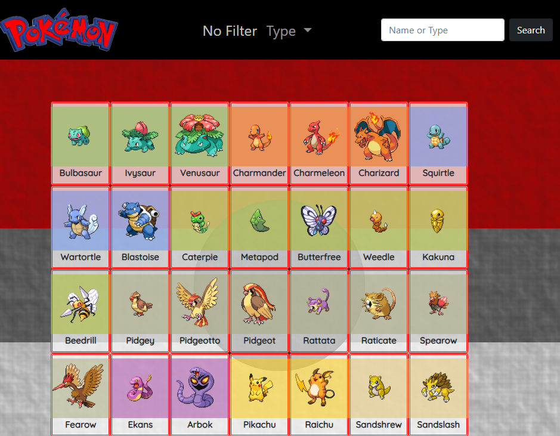

# Sean Andrew Stanek's Portfolio

Welcome to my portfolio showcasing my full-stack development abilities. This portfolio features a collection of projects that highlight my skills in HTML, CSS, JavaScript, React, Node.js, and more.

## Table of Contents

- [Projects](#projects)
  - [Pokemon Search](#pokemon-search)
  - [LetsMeet](#letsmeet)
  - [This Website](#this-website)
  - [Movie API / Client](#movie-api--client)
- [Contact](#contact)
- [License](#license)

## Projects

### Pokemon Search

- **Description:** Created a dynamic Pokémon information app leveraging the Pokémon API. The app showcases proficiency in DOM manipulation, Ajax, and asynchronous behavior.
- **Tech Stack:** React, Node, oAuth, Serverless, PWA, Jest, Gherkin, Puppeteer
- **Repository:** [Pokemon Search Repository](https://github.com/Sean-Andrew-Stanek/fs-exercise-1.1-js-app)
- **Live Demo:** [See it deployed](https://sean-andrew-stanek.github.io/fs-exercise-1.1-js-app/)

### LetsMeet

- **Description:** Developed a serverless React app with OAuth integration, featuring Lambda functions for reading and organizing conference meeting times from a calendar.
- **Tech Stack:** React, Node, oAuth, Serverless, PWA, Jest, Gherkin, Puppeteer
- **Repository:** [LetsMeet Repository](https://github.com/Sean-Andrew-Stanek/letsmeet)
- **Live Demo:** [See it deployed](https://sean-andrew-stanek.github.io/letsmeet/)

### This Website!

- **Description:** Designed a dynamic and visually appealing portfolio website showcasing proficiency in front-end development. The site features engaging animations, responsive design, and a versatile color scheme.
- **Tech Stack:** HTML, CSS, JavaScript, SVG Animation
- **Repository:** [Portfolio Website Repository](https://github.com/Sean-Andrew-Stanek/portfolio-website)
- **Live Demo:** [See it deployed](https://sean-andrew-stanek.github.io/portfolio-website/)

### Movie API / Client

- **Description:** Designed and implemented a Full Stack Movie Database Application, showcasing a blend of backend and frontend expertise.
- **Tech Stack:** Node.js, Express.js, MongoDB, Mongoose, Passport.js, JWT, bcrypt, React.js, React Bootstrap, React Router, JavaScript, HTML, CSS
- **Repositories:**
  - [Movie API Client Repository](https://github.com/Sean-Andrew-Stanek/movie_api_client)
  - [Movie API Database Repository](https://github.com/Sean-Andrew-Stanek/movie_api)

## Contact

Feel free to reach out to me via [email](mailto:sean.andrew.stanek@gmail.com) or on [Discord](https://discordapp.com/users/323806687750389771). You can also find me on [GitHub](https://github.com/Sean-Andrew-Stanek) and [LinkedIn](#).

## License

This project is licensed under the [ISC License](LICENSE).
